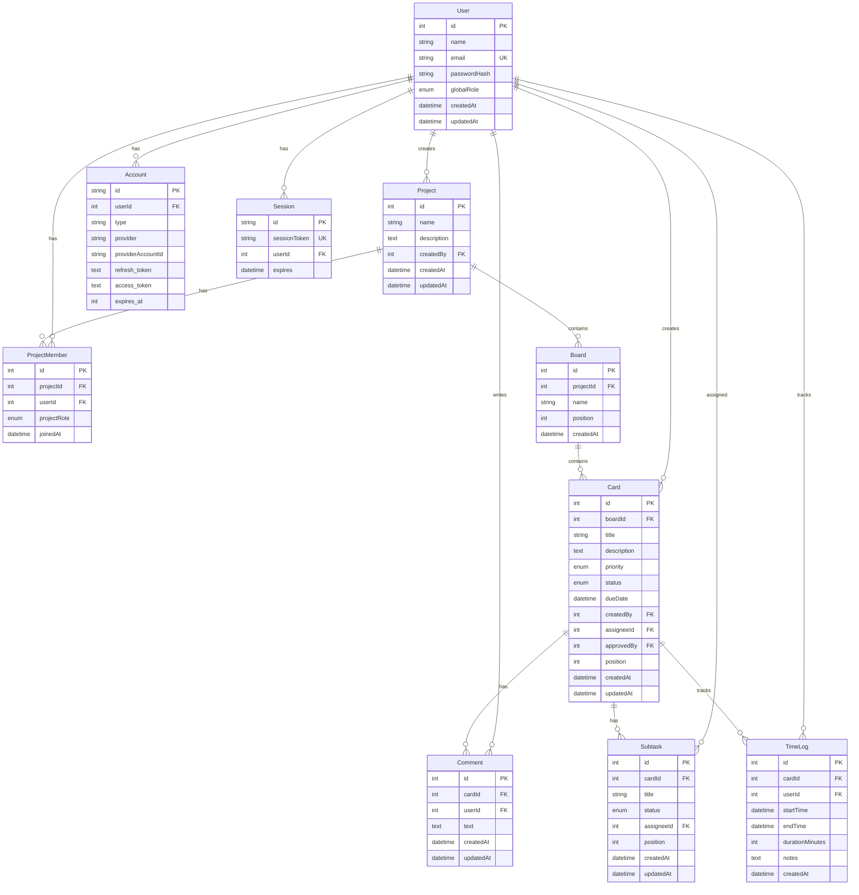

# Entity Relationship Diagram (ERD)

Sistem **Manajemen Proyek UKK** - Database Schema

## 📊 Mermaid Diagram



---

## 📋 Table Descriptions

### **User**

Menyimpan data pengguna sistem dengan role global (ADMIN, LEADER, MEMBER).

**Relations:**

- 1 User → many ProjectMember
- 1 User → many Project (sebagai creator)
- 1 User → many Card (sebagai creator)
- 1 User → many Comment
- 1 User → many TimeLog
- 1 User → many Subtask (sebagai assignee)

---

### **Project**

Representasi proyek yang dikelola dalam sistem.

**Relations:**

- 1 Project → many ProjectMember
- 1 Project → many Board
- 1 Project ← 1 User (creator)

**Business Rules:**

- Hanya Admin atau Leader yang bisa membuat project
- Project creator otomatis jadi member dengan role LEADER

---

### **ProjectMember**

Junction table untuk relasi many-to-many antara User dan Project dengan role spesifik per project.

**Project Roles:**

- **LEADER**: Mengelola project, assign tasks, approve work
- **DEVELOPER**: Mengerjakan code-related tasks
- **DESIGNER**: Mengerjakan design-related tasks
- **OBSERVER**: View-only access

**Unique Constraint:** `(projectId, userId)` - satu user hanya bisa punya 1 role per project

---

### **Board**

Kolom Kanban dalam project (contoh: To Do, In Progress, Review, Done).

**Relations:**

- 1 Board → many Card
- 1 Board ← 1 Project

**Fields:**

- `position`: Urutan board (untuk drag & drop)

---

### **Card**

Task/card dalam board dengan detail lengkap.

**Relations:**

- 1 Card → many Subtask
- 1 Card → many Comment
- 1 Card → many TimeLog
- 1 Card ← 1 Board
- 1 Card ← 1 User (creator)

**Enums:**

- **Priority**: LOW, MEDIUM, HIGH
- **Status**: TODO, IN_PROGRESS, REVIEW, DONE

**Business Rules:**

- Developer/Designer hanya boleh punya 1 card dengan status IN_PROGRESS
- Card tidak bisa DONE tanpa minimal 1 TimeLog
- Hanya Leader/Admin yang bisa approve (set `approvedBy`)

---

### **Subtask**

Sub-tugas dari card utama untuk breakdown task yang kompleks.

**Relations:**

- 1 Subtask ← 1 Card
- 1 Subtask ← 1 User (assignee, optional)

**Fields:**

- `status`: Menggunakan enum Status yang sama dengan Card
- `assigneeId`: Bisa berbeda dengan assignee card utama

---

### **Comment**

Komentar diskusi pada card untuk kolaborasi tim.

**Relations:**

- 1 Comment ← 1 Card
- 1 Comment ← 1 User

**Business Rules:**

- Required untuk daily progress updates
- Admin tidak bisa delete historical comments

---

### **TimeLog**

Tracking waktu kerja pada card.

**Relations:**

- 1 TimeLog ← 1 Card
- 1 TimeLog ← 1 User

**Fields:**

- `startTime`: Waktu mulai kerja
- `endTime`: Waktu selesai (null jika masih running)
- `durationMinutes`: Auto-calculated dari startTime - endTime
- `notes`: Catatan optional

**Business Rules:**

- Required sebelum mark card as DONE
- Developer/Designer bisa start/stop timer
- Hanya 1 active timer (endTime = null) per user

---

### **Account & Session**

NextAuth tables untuk authentication.

**Account**: OAuth provider accounts (Google, GitHub, etc.)
**Session**: Active user sessions dengan JWT

---

## 🔐 Business Rules Summary

1. **User Access Control**

   - ADMIN: Full access ke semua project dan user management
   - LEADER: Create/manage project, assign tasks, approve work
   - MEMBER: Basic user, join project as DEVELOPER/DESIGNER

2. **Project Membership**

   - User bisa join multiple projects dengan role berbeda
   - Unique constraint per (projectId, userId)

3. **Task Management**

   - 1 user max 1 IN_PROGRESS task
   - Card butuh minimal 1 TimeLog sebelum DONE
   - Leader/Admin only yang bisa approve

4. **Time Tracking**

   - Start/stop timer per card
   - Auto calculate duration
   - Required untuk mark task complete

5. **Data Integrity**
   - Cascade delete untuk relasi parent-child
   - Set null untuk optional foreign keys
   - Unique constraints untuk prevent duplicate

---

## 🎯 Key Indexes (Recommended)

```sql
-- Performance indexes
CREATE INDEX idx_project_members_user ON project_members(userId);
CREATE INDEX idx_project_members_project ON project_members(projectId);
CREATE INDEX idx_cards_board ON cards(boardId);
CREATE INDEX idx_cards_assignee ON cards(assigneeId);
CREATE INDEX idx_cards_status ON cards(status);
CREATE INDEX idx_time_logs_card ON time_logs(cardId);
CREATE INDEX idx_time_logs_user ON time_logs(userId);
CREATE INDEX idx_comments_card ON comments(cardId);
```

---

## 📈 Statistics & Reporting

### Query Examples:

**Get user workload:**

```sql
SELECT u.name, COUNT(c.id) as active_tasks
FROM users u
LEFT JOIN cards c ON c.assigneeId = u.id
WHERE c.status = 'IN_PROGRESS'
GROUP BY u.id;
```

**Get project progress:**

```sql
SELECT
  p.name,
  COUNT(c.id) as total_cards,
  SUM(CASE WHEN c.status = 'DONE' THEN 1 ELSE 0 END) as completed,
  SUM(CASE WHEN c.status = 'DONE' THEN 1 ELSE 0 END) * 100 / COUNT(c.id) as progress_pct
FROM projects p
LEFT JOIN boards b ON b.projectId = p.id
LEFT JOIN cards c ON c.boardId = b.id
GROUP BY p.id;
```

**Get time tracking summary:**

```sql
SELECT
  u.name,
  SUM(tl.durationMinutes) as total_minutes,
  COUNT(DISTINCT tl.cardId) as cards_worked
FROM time_logs tl
JOIN users u ON u.id = tl.userId
WHERE tl.startTime >= DATE_SUB(NOW(), INTERVAL 7 DAY)
GROUP BY u.id;
```

---

Generated: Oktober 28, 2025  
Version: 1.0  
Database: MySQL (via Prisma ORM)
